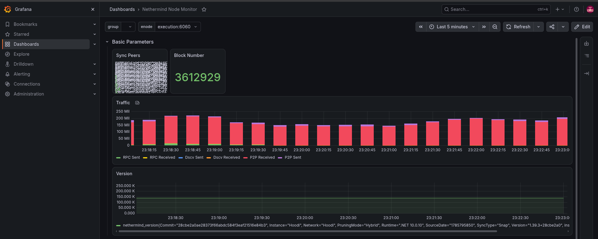
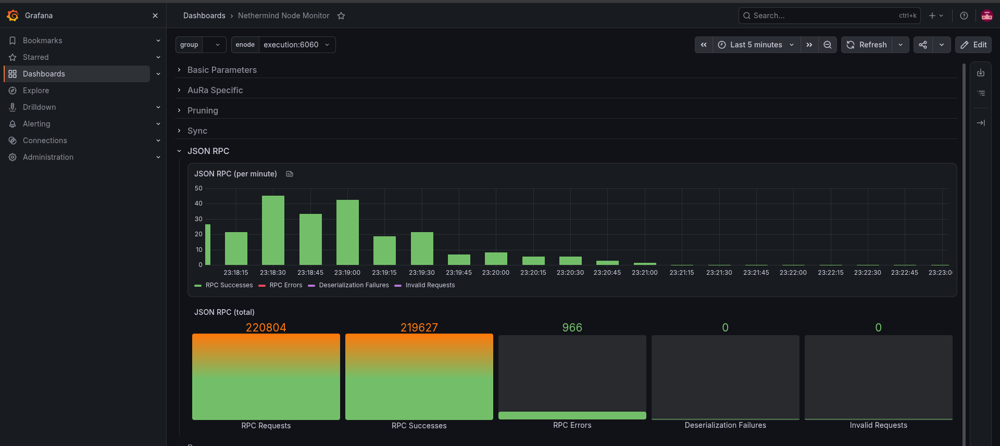
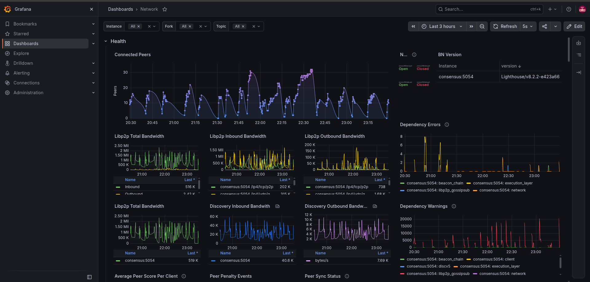

[🇬🇧 English version](./README.en.md)

# Ethereum Infra Lab

> Nodo Ethereum completo (execution + consensus) operado como infraestructura real, no como
> tutorial: Docker Compose, reverse proxy, DNS, monitoreo con Prometheus/Grafana, firewall
> y un runbook con **incidentes reales** encontrados y resueltos mientras se operaba.
> Corre sobre testnet Hoodi por defecto para no requerir ~2TB de disco ni días de sync.

**Tres incidentes reales documentados en [`RUNBOOK.md`](./RUNBOOK.md)**: un path de volumen
mal mapeado que llenó el disco del homelab (67.8GB en un volumen anónimo, crash-loop de
155 reinicios), una saturación de RAM/swap que rompía el scraping de métricas, y un
dashboard comunitario de Grafana con una variable rota que dejaba todo en "No data". Los
tres con diagnóstico paso a paso, causa raíz y fix — no son hipotéticos, pasaron corriendo esto.

## Screenshots


*Nethermind Node Monitor: peers, block number, tráfico de red y versión, con data real del nodo ya sincronizado en Hoodi.*


*Detalle de requests JSON-RPC (éxitos, errores, deserialization failures) — útil para detectar abuso o mala configuración de clientes.*


*Lighthouse Network: peers conectados, ancho de banda libp2p, errores/warnings de dependencias (execution layer, gossipsub, discv5).*

## Cómo se armó esto

No es un tutorial copiado: quedó armado, roto y arreglado en una sesión real de trabajo.
Cronología resumida (detalle completo de cada incidente en [`RUNBOOK.md`](./RUNBOOK.md)):

1. Diseño inicial: Nethermind + Lighthouse en Docker Compose, JWT compartido para el Engine API, nginx solo exponiendo Grafana (nunca el RPC).
2. Primer deploy → **incidente 1**: un path de volumen mal mapeado (`/nethermind/data` en vez de `/nethermind/nethermind_db`) hizo que Docker creara un volumen anónimo que creció a 67.8GB en 5 horas y llenó el disco del homelab → crash-loop de 155 reinicios.
3. Fix: corregir el path, mover los datos al HDD (`/data`, no la SSD raíz), agregar límite de logs. Nodo sincroniza de verdad.
4. **Incidente 2**: con el nodo sincronizado, `execution` + `consensus` combinados consumían ~7GB de RAM en un homelab de 13.6GB ya compartido con otros servicios → swap al 100%, Prometheus perdía el scrape de Lighthouse por timeout.
5. Se documentó como limitación real de recursos (no hay atajo de config que la resuelva) y se agregó una alerta `HostMemoryLow` para detectarla antes la próxima vez.
6. Grafana + Prometheus armados, dashboards importados desde Grafana.com y desde el repo oficial de Lighthouse → **incidente 3**: el dashboard de Nethermind (ID 18746) filtraba por una etiqueta (`nethermind_group`) que no existe en esta versión del cliente. Diagnóstico vía PromQL directo, fix sin tocar los ~80 paneles uno por uno.
7. Firewall (`ufw`) documentado pero **no activado** a propósito: el homelab comparte server con otros servicios (Jellyfin, TeamSpeak, Wazuh) que se hubieran cortado con un `deny incoming` sin antes relevar todos sus puertos — decisión consciente, no un olvido.

## Arquitectura

```
Internet ──(Cloudflare DNS, proxy naranja)── nginx:80/443 ── grafana:3000
                                                                  │
                                                             prometheus:9090
                                                              │         │
                                                    node-exporter   ┌───┴───┐
                                                                    │       │
                                                              execution  consensus
                                                            (Nethermind) (Lighthouse)
                                                                    │       │
                                                                    └───┬───┘
                                                                  JWT compartido
                                                                (auth Engine API)
```

- **execution** (Nethermind): JSON-RPC (8545) y Engine API (8551) — **solo en la red interna de Docker**, nunca expuestos a internet (ver `nginx/nginx.conf`, motivo explicado ahí).
- **consensus** (Lighthouse): beacon node, habla con execution via Engine API autenticada por JWT.
- **prometheus + node-exporter**: métricas de los dos clientes + del host.
- **grafana**: único servicio expuesto públicamente (detrás de nginx + Cloudflare).
- **nginx**: reverse proxy y punto único de entrada.

## Por qué el RPC no se expone

Un JSON-RPC público mal configurado es el vector más común de robo de fondos y abuso de nodo
(scraping, spam de requests, exfiltración de datos privados del mempool local). Este lab
lo deja cerrado a propósito y lo documenta en `nginx/nginx.conf` y `RUNBOOK.md` (#4).

## Setup

```bash
cp .env.example .env        # editar ETH_NETWORK, password de Grafana, dominio
mkdir -p jwt
openssl rand -hex 32 > jwt/jwt.hex

docker compose up -d
docker compose logs -f execution consensus   # ver progreso de sync
```

Métricas: `docker compose ps` para confirmar que los 6 servicios están `Up`.
Grafana en `http://localhost:8090` (puerto 8090 porque 80/443 ya los usan otros
servicios del homelab) — datasource de Prometheus (`http://prometheus:9090`) y
tres dashboards ya importados:
- **Nethermind Node Monitor** — [grafana.com/grafana/dashboards/18746](https://grafana.com/grafana/dashboards/18746-nethermind/)
- **Lighthouse Summary** y **Lighthouse Network** — del repo oficial
  [sigp/lighthouse-metrics](https://github.com/sigp/lighthouse-metrics/tree/master/dashboards)

(Ojo: `grafana.com/api/dashboards/<id>` no valida que el ID sea el que uno cree —
confirmar siempre el título del dashboard antes de importarlo a ciegas.)

## DNS / Cloudflare

Paso manual, no automatizable sin tus credenciales:
1. En Cloudflare, crear un registro `A` (o `CNAME`) para `grafana.tudominio.com` apuntando
   a la IP pública del homelab, con el proxy (nube naranja) activado.
2. Puerto forwarding en el router: 80/443 públicos → IP del homelab, puerto 8090 (nginx
   corre ahí porque 80/443 ya están ocupados por otros servicios del homelab).
3. TLS: usar Cloudflare en modo "Flexible" para arrancar simple, o certbot en nginx para
   TLS end-to-end más adelante (no incluido en este lab v1).

## Firewall

`firewall/setup-ufw.sh` queda **documentado pero sin activar** a propósito: el homelab real
donde corre este proyecto comparte server con otros servicios (Jellyfin, TeamSpeak,
Portainer, Wazuh, etc.) que hoy no tienen reglas propias, y `ufw default deny incoming`
los cortaría a todos si se prende sin antes relevar esos puertos. El script sirve como
evidencia de qué reglas harían falta para este proyecto puntual — ver comentarios adentro.

## Runbook e incidentes

Ver [`RUNBOOK.md`](./RUNBOOK.md) — 8 escenarios, 3 de ellos incidentes reales con
diagnóstico completo (disco lleno, presión de memoria, dashboard con variable rota).
Simulacro de caída de servicio:

```bash
./scripts/simulate-outage.sh execution
```

## Roadmap (no implementado todavía)

- [ ] TLS end-to-end con certbot en vez de depender solo del modo Flexible de Cloudflare
- [ ] Alertmanager real (hoy las alertas solo se ven en Prometheus/Grafana, no notifican)
- [ ] Pruning / control de crecimiento de disco si se migra a mainnet

## Licencia

[MIT](./LICENSE)
